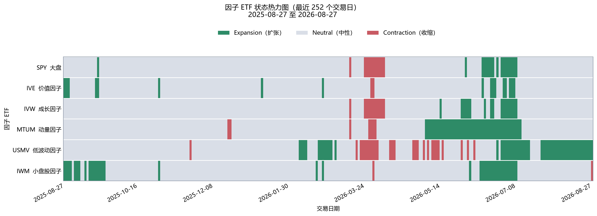
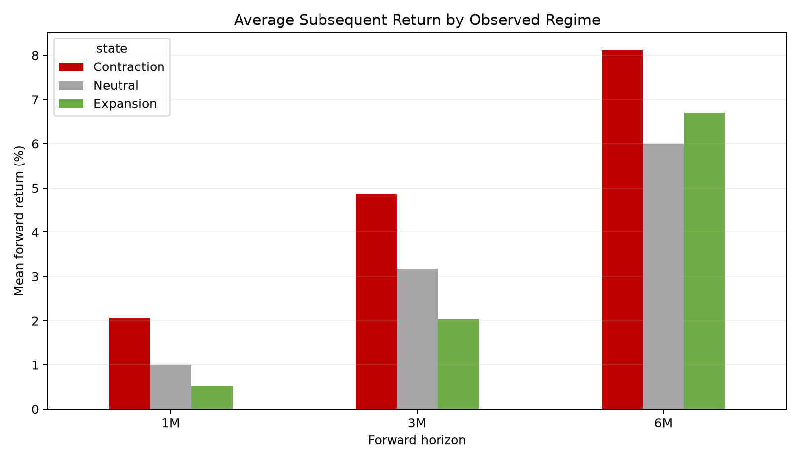
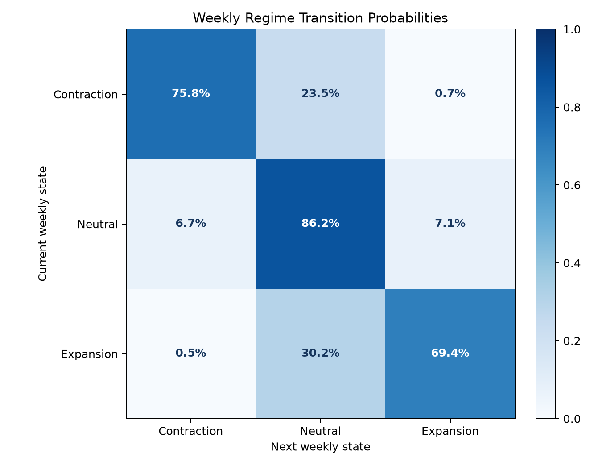
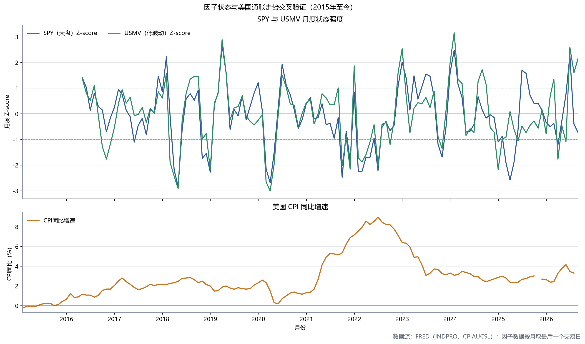

# 因子风格状态监测框架 Factor Regime Monitor

基于因子 ETF 构建的市场风格状态监测框架，用滚动收益率、波动率与 Z-score 方法量化跟踪市场风格轮动（价值/成长/动量/低波动/大盘/小盘），并对照美国宏观经济数据做交叉验证。

## 最新状态快照

**市场数据截至 2026-08-27。** 当前风格呈现防御性偏强、分化较明显的特征：

| 观察对象 | 当前状态 | Z-score | 解读 |
|---|---|---:|---|
| USMV（低波动） | 扩张 | 2.16 | 显著强于过去 252 个交易日的历史水平 |
| IWM（小盘） | 收缩 | -1.00 | 小盘风格明显偏弱 |
| MTUM（动量） | 中性、接近收缩 | -0.83 | 距离收缩阈值较近，值得持续观察 |

宏观交叉验证受月度数据缺失影响，最新连续 12 个月完整相关窗口截至 **2025-09**；这与市场状态快照的日期不同，页面和脚本不进行插值或前向填充。



快速查看：[最新文字简报](latest_regime_summary.txt) · [宏观相关性摘要](macro_correlation_summary.txt) · [宏观对照图](regime_vs_macro.png)

## 状态标签的前瞻验证

为了检验状态标签是否具有预测意义，项目增加了严格的时点检验：每个交易日只使用当时可获得的63日滚动收益和过去252日分布确定状态，再统计随后1、3和6个月收益。下表为六只ETF的平均结果：

| 后续期限 | 收缩状态 | 中性状态 | 扩张状态 |
|---|---:|---:|---:|
| 1个月 | 2.07% | 1.00% | 0.52% |
| 3个月 | 4.86% | 3.17% | 2.04% |
| 6个月 | 8.11% | 6.00% | 6.70% |



结果不支持“扩张状态必然带来更高后续收益”的简单预测解释。相反，收缩状态后的平均收益更高，可能反映均值回归、ETF差异和重叠样本影响。因此，本框架更适合描述当前市场结构和风险偏好，而不应单独用作择时信号。

每周状态转移矩阵显示状态具有一定持续性：收缩、 中性和扩张状态下一周保持原状态的概率分别约为75.8%、86.2%和69.4%。



复现脚本：[validate_regime_signal.py](validate_regime_signal.py)。详细分组结果保存在 `validation_outputs/forward_return_by_state.csv`，状态转移概率保存在 `validation_outputs/weekly_state_transition_matrix.csv`。

## 项目背景

投研工作中常需要判断"当前市场处于什么风格阶段"（比如价值股占优还是成长股占优、防御性资产是否走强等）。本项目尝试用可复现的量化方法，把这种判断从"凭感觉"变成"有数据支撑的结构化结论"。

## 方法概述

1. **数据获取**：通过 yfinance 下载 6 只代表性因子 ETF（SPY 大盘、IVE 价值、IVW 成长、MTUM 动量、USMV 低波动、IWM 小盘）2015 年至今的历史价格
2. **指标计算**：计算 63 个交易日（约 3 个月）滚动年化收益率与波动率
3. **状态判断**：对每个因子的滚动收益率，相对其过去 252 个交易日（约 1 年）的历史均值和标准差计算 Z-score，据此将其状态分类为「扩张」「中性」「收缩」三种
4. **可视化输出**：生成状态热力图，并自动生成中文文字简报
5. **宏观交叉验证**：叠加美国 CPI 同比、工业生产指数等宏观数据，做滚动相关性分析（描述性观察，非因果推断）

## 文件说明

| 文件 | 作用 |
|---|---|
| `download_factor_etf_prices.py` | 下载并缓存因子 ETF 历史价格 |
| `calculate_factor_etf_metrics.py` | 计算滚动年化收益率与波动率 |
| `calculate_regime_zscore.py` | 计算 Z-score 并分类市场状态 |
| `generate_regime_report.py` | 生成状态热力图与文字简报 |
| `compare_regime_with_macro.py` | 叠加宏观数据做交叉验证（需配置 FRED API key） |
| `validate_regime_signal.py` | 检验不同状态后的1/3/6个月收益与状态转移概率 |

## 示例输出

**与宏观数据交叉验证**



## 如何运行

```bash
pip install -r requirements.txt

python download_factor_etf_prices.py --refresh
python calculate_factor_etf_metrics.py
python calculate_regime_zscore.py
python generate_regime_report.py

# 可选：宏观数据对照，需先设置环境变量 FRED_API_KEY
python compare_regime_with_macro.py
```

## 说明与局限

- 因子 ETF 仅作为对应投资风格的代理（proxy），而非严格的学术因子定义
- Z-score 阈值（±1）可通过命令行参数调整
- 宏观相关性分析样本有限（12 个月滚动窗口），仅作描述性观察，不构成预测信号或投资建议
- “最新市场状态”和“最新完整宏观相关窗口”采用各自可获得的数据截止日，不能混为同一时点结论
- 前瞻收益使用重叠持有期观测，结果用于描述性稳健性检查，不代表独立交易次数或可执行策略收益

## 后续计划

正在扩展为 A 股版本，使用 akshare 等本土数据源，替换美股 ETF 与 FRED 宏观数据。
